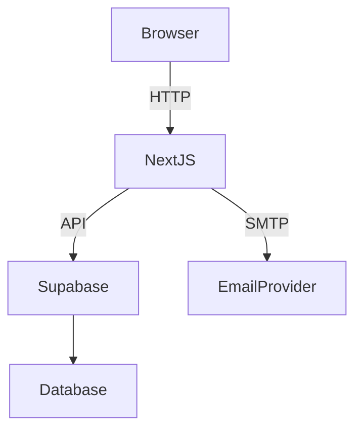
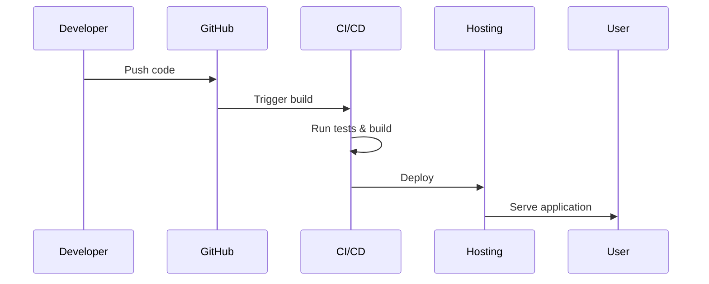

# User Management Module Setup Guide

This guide explains how to set up the User Management module for local development and production deployments.

## 1. Environment Setup

### Prerequisites
- **Node.js 18+**
- **npm** (or **yarn/pnpm**)
- **Git**
- **Supabase CLI** (`npm install -g supabase`)

### Required Environment Variables
Create a `.env.local` file based on `.env.example` and provide the following values:

| Variable | Description | Example |
| -------- | ----------- | ------- |
| `NEXT_PUBLIC_SUPABASE_URL` | Supabase project URL | `https://your-project.supabase.co` |
| `NEXT_PUBLIC_SUPABASE_ANON_KEY` | Supabase anon key for client-side requests | `public-anon-key` |
| `SUPABASE_SERVICE_ROLE_KEY` | Supabase service role key (server only) | `service-role-key` |
| `NEXT_PUBLIC_API_URL` | Base URL for API requests | `http://localhost:3000/api` |
| `NEXT_PUBLIC_APP_URL` | URL where the frontend is served | `http://localhost:3000` |
| `SENDGRID_API_KEY` | API key for SendGrid email provider | `SG.xxxxx` |
| `SUPABASE_SMTP_SENDER` | Default "from" address for outgoing emails | `noreply@yourdomain.com` |
| `SUPABASE_SMTP_SERVER` | SMTP host for Supabase email | `smtp.sendgrid.net` |
| `SUPABASE_SMTP_PORT` | SMTP port | `587` |
| `SUPABASE_SMTP_USERNAME` | SMTP username | `apikey` |
| `SUPABASE_SMTP_PASSWORD` | SMTP password | `SG.xxxxx` |

### Third‑Party Services
- **Supabase** – create a project and copy the URL and keys above. Run migrations via the Supabase CLI.
- **Email Provider** – the example uses SendGrid. Configure the SMTP variables accordingly.

### Development Environment
1. Install dependencies:
   ```bash
   npm install
   ```
2. Start Supabase locally and apply migrations:
   ```bash
   supabase start
   supabase db reset
   ```
3. Launch the Next.js dev server:
   ```bash
   npm run dev
   ```



## 2. Installation Instructions
1. **Clone the repository**
   ```bash
   git clone <repository-url>
   cd User-Mgmt
   ```
2. **Install dependencies**
   ```bash
   npm install
   ```
3. **Initialize the database**
   ```bash
   supabase db reset
   ```
   Add seed SQL files under `supabase/` if you need test data.
4. **Run the development server**
   ```bash
   npm run dev
   ```

## 3. Configuration Options
The module is configured through `UserManagementProvider`.

```typescript
interface UserManagementConfig {
  apiBaseUrl?: string;
  callbacks?: IntegrationCallbacks;
  layout?: LayoutOptions;
  storageKeyPrefix?: string;
  notifications?: NotificationConfig;
  twoFactor?: TwoFactorProviderConfig;
  subscription?: SubscriptionProviderConfig;
  corporateUsers?: CorporateUserConfig;
  oauth?: OAuthModuleConfig;
  features?: Record<string, boolean>; // feature flags
}
```

Example usage:
```tsx
<UserManagementProvider
  config={{
    apiBaseUrl: process.env.NEXT_PUBLIC_API_URL,
    features: { subscriptions: true, corporateUsers: false },
  }}
>
  {/* your app */}
</UserManagementProvider>
```
The host application can replace any service or UI component via this configuration to keep the module pluggable.

## 4. Deployment Guidelines
1. **Build for production**
   ```bash
   npm run build
   ```
2. **Set environment variables** in your hosting platform. Never commit secrets.
3. **Security Considerations**
   - Only expose the anon key to the client.
   - Keep the service role key on the server and restrict network access.
   - Rotate API keys regularly.
4. **Performance Optimization**
   - Enable caching headers where possible.
   - Use a CDN for static assets.
   - Monitor Supabase database performance.



This completes the setup process for running and deploying the User Management module.
