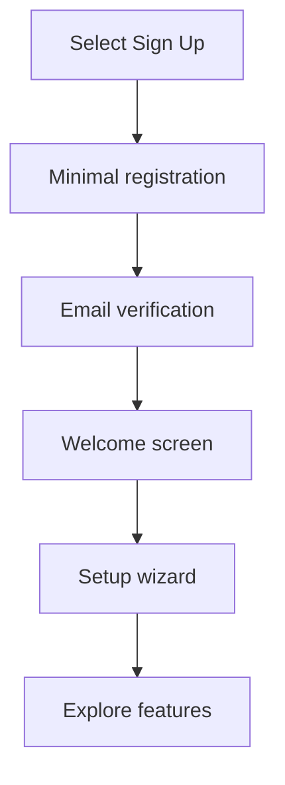
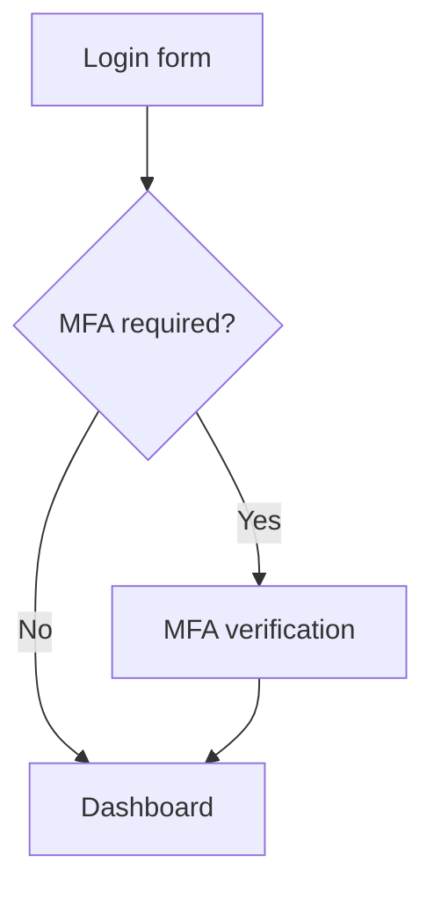
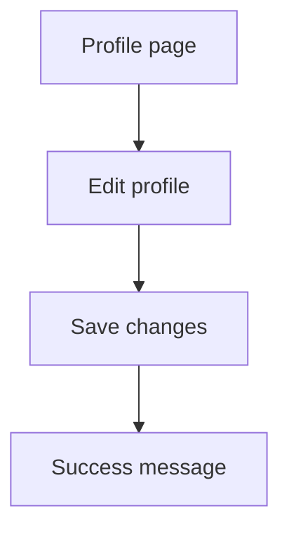
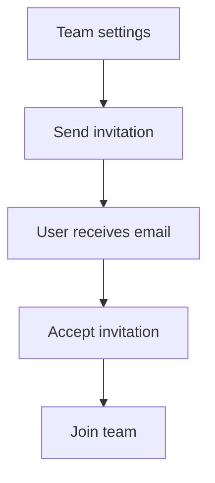
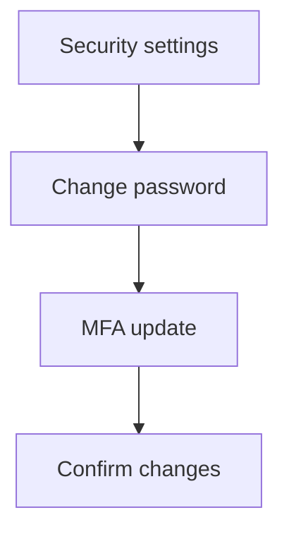

# Optimized User Journeys

This document maps the current flows of common user actions and proposes streamlined versions.

## 1. First‑Time User Experience

### Current Flow & Friction
1. User selects **Sign Up**.
2. Registration form shows all fields at once.
3. After registration, user lands on dashboard with little guidance.
4. Features are visible immediately which can feel overwhelming.

### Optimized Flow

1. Display only essential fields at first.
2. After verification, show a **Welcome screen** introducing the module.
3. Guide the user through a **Setup wizard** (preferences, notifications, feature tour).
4. Gradually reveal advanced options after completion.

## 2. Authentication Experience

### Current Flow & Friction
1. User enters email and password.
2. If MFA enabled, a second screen requests the code.
3. "Remember me" is available but its effect is unclear.

### Optimized Flow

- Provide inline explanation for **Remember me** (e.g., "Keep me logged in for 30 days").
- On successful password entry, automatically focus the MFA field.
- After MFA verification, redirect seamlessly to the desired page.

## 3. Common Task Optimization

### Profile Updates

- Highlight incomplete fields during onboarding.
- Provide real‑time validation and success feedback.

### Team Invitation & Acceptance

- Show seat usage and clear success/error messages in the invite dialog.

### Password Changes & Security Settings

- Provide guidance for strong passwords and highlight MFA options.

