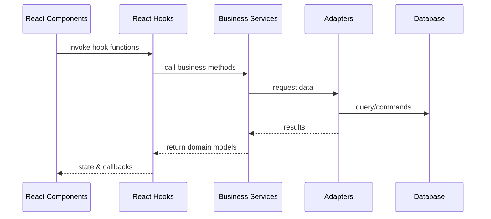
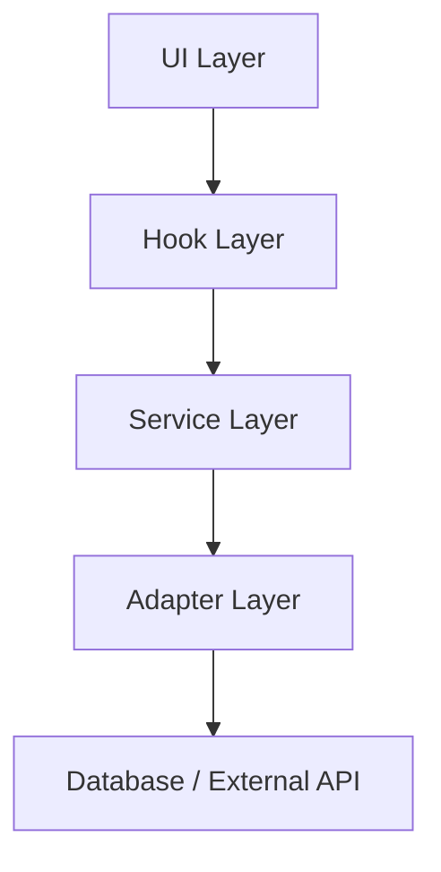
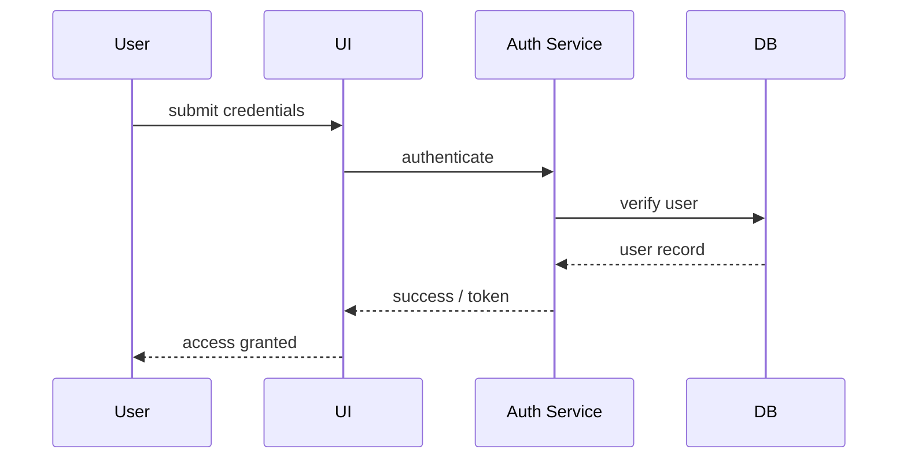

# User Management Module: Architecture Overview

This document provides a comprehensive overview of the User Management Module architecture. It complements the existing [Architecture Guidelines](./Architecture%20Guidelines.md) and [Architecture Rules](./Architecture%20Rules.md) by illustrating how the different layers interact and where extension points exist.

## 1. System Overview

### 1.1 Context Diagram

```mermaid
C4Context
    title User Management Module Context
    Person(admin, "Administrator")
    Person(user, "End User")
    System_Boundary(UMM, "User Management Module") {
        Container(webapp, "Host Application", "Next.js + React")
        Container(auth, "Authentication Service", "e.g., Supabase Auth")
        Container(db, "Database", "PostgreSQL / Other")
    }
    admin --> webapp: configures users
    user --> webapp: interacts via UI
    webapp --> auth: authentication requests
    webapp --> db: user data CRUD
```

### 1.2 Container Diagram

```mermaid
C4Container
    title User Management Container Diagram
    System_Boundary(UMM, "User Management Module") {
        Container(api, "Next.js API Routes", "REST/GraphQL")
        Container(frontend, "React App", "Next.js Pages/Components")
        ContainerDb(db, "Database", "Supabase/PostgreSQL")
        Container(ext, "External Services", "Email, Payment, etc.")
    }
    api -> db: read/write
    frontend -> api: HTTPS
    api -> ext: adapters
```

### 1.3 Component Interaction Flow



### 1.4 Data Flow Diagram



### 1.5 Authentication Flows



## 2. Layer Descriptions

### 2.1 Core Domain Layer
Defines entities such as `User`, `Role`, and `Permission`. Relationships:
- `User` *has many* `Role`
- `Role` *grants many* `Permission`

### 2.2 Adapter Layer
Responsible for all external integrations. Default adapters include:
- `SupabaseAuthAdapter` for authentication
- `PrismaUserAdapter` for database access
All adapters implement interfaces so they can be replaced.

### 2.3 Service Layer
Contains business logic organized by domain:
- `UserService` handles user CRUD and profile rules
- `RoleService` manages roles and permissions
- `SessionService` coordinates login state
Services depend only on adapter interfaces and core types.

### 2.4 Hook Layer
Provides React hooks that wrap services. Patterns include:
- State management via Zustand or React state
- Exposure of asynchronous actions (e.g., `useUser()` returning `{user, loadUser}`)
Hooks never access adapters directly.

### 2.5 UI Layer
Headless and styled components compose the UI. Component hierarchy typically follows:
- `pages/` or feature root
- `headless/` components (behavior via render props)
- `styled/` components (default appearance)

## 3. Extension Points

### 3.1 Service Replacement
All services are configured through a module setup function:
```typescript
interface UserManagementConfig {
  authService?: AuthService;
  userService?: UserService;
  // ...other services
}
```
Host applications may provide custom implementations when calling `configureUserManagement()`.

### 3.2 UI Customization
Headless components expose render props so host apps can supply their own UI. Styled components can be replaced entirely or extended with custom styling.

### 3.3 Authentication Provider Integration
Authentication is abstracted behind the `AuthService` interface. Implementations for Supabase, Auth0, etc. can be swapped without affecting other layers.

## 4. Security Model

### 4.1 Authentication Mechanisms
Supports JWT-based sessions via the configured `AuthService`. Tokens are stored using HTTP-only cookies for protection against XSS.

### 4.2 Authorization Approach
Role-based access control (RBAC) is enforced in the service layer. Permissions are checked before performing sensitive actions.

### 4.3 Data Protection Strategies
- Passwords hashed using bcrypt (or external provider)
- Sensitive API routes protected via middleware
- Database access restricted to adapter implementations

## 5. C4 Model Levels

### 5.1 Context Level
Depicted in the **Context Diagram** above showing how administrators and end users interact with the module via the host application.

### 5.2 Container Level
Shown in the **Container Diagram**, outlining API routes, React frontend, database, and integrations.

### 5.3 Component Level
Service, adapter, hook, and UI components interact as in the **Component Interaction Flow** diagram.

### 5.4 Code Level
Within services and adapters, follow the interface-first design. Example:
```typescript
export interface UserService {
  getUser(id: string): Promise<User | null>;
  createUser(data: NewUser): Promise<User>;
  // ...
}

export class DefaultUserService implements UserService {
  constructor(private adapter: UserAdapter) {}
  async getUser(id: string) {
    return this.adapter.findById(id);
  }
  // ...
}
```

This layered, pluggable structure ensures the User Management Module can adapt to different databases, authentication providers, and UI frameworks while maintaining strict separation of concerns.
